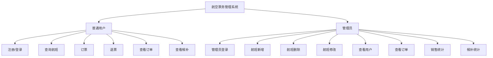
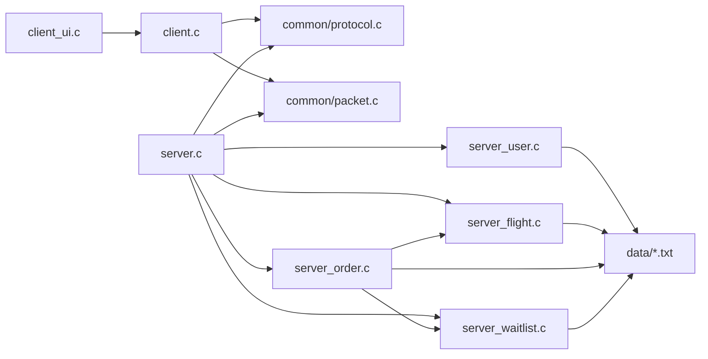
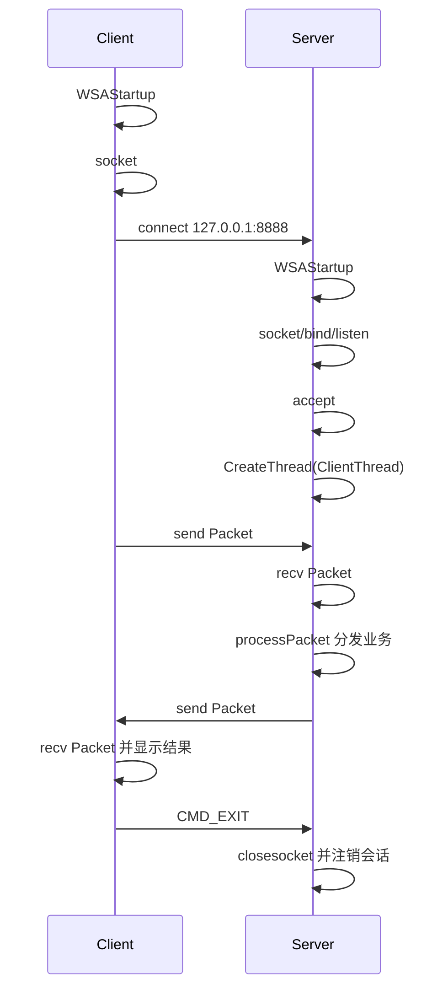
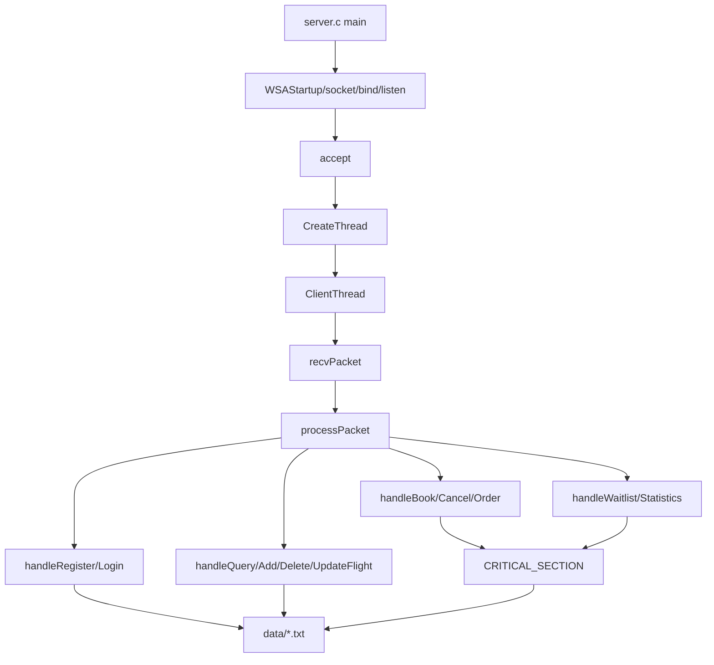
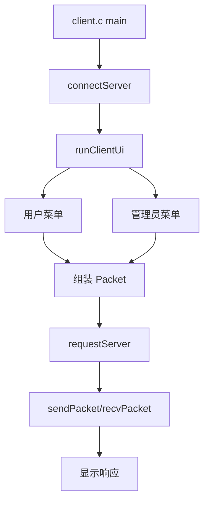

# 航空票务管理系统网络版设计文档

## 1. 项目结构树

```text
plane/
├─admin.c/admin.h                 旧单机版管理员功能，保留
├─file.c/file.h                   旧单机版输入与文件读写，保留
├─flight.c/flight.h               旧单机版航班管理，保留
├─main.c                          旧单机版入口，保留
├─passenger.c/passenger.h         旧单机版订票退票，保留
├─queue.c/queue.h                 旧单机版候补队列，保留
├─user.c/user.h                   旧单机版用户管理，保留
├─common/
│  ├─config.h                     服务器地址、端口、数据文件路径
│  ├─packet.h / packet.c          统一命令码和 Packet
│  └─protocol.h / protocol.c      定长包 send/recv 工具
├─server/
│  ├─server.h                     服务端数据结构、会话、处理函数声明
│  ├─server.c                     Winsock 服务端入口、多线程、processPacket
│  ├─server_user.c                注册、登录、查看用户
│  ├─server_flight.c              航班增删改查
│  ├─server_order.c               订票、退票、订单、电子客票、积分
│  └─server_waitlist.c            候补队列、销售统计、上座率统计
├─client/
│  ├─client.h / client.c          客户端连接、请求发送、响应接收
│  └─client_ui.h / client_ui.c    控制台菜单 UI
├─data/
│  ├─users.txt                    用户、积分、等级、管理员标记
│  ├─flights.txt                  航班
│  ├─passengers.txt               乘客样例，兼容旧功能资料
│  ├─orders.txt                   订单和电子客票
│  └─waitlist.txt                 候补队列
├─plane.vcxproj                   旧单机版工程，保留
├─plane_server.vcxproj            网络版服务端工程
├─plane_client.vcxproj            网络版客户端工程
└─plane.sln                       同时包含旧版、服务端、客户端
```

## 2. 功能结构图



## 3. 模块依赖图



## 4. 当前旧项目分析

旧项目按功能拆成 `admin/user/flight/passenger/queue/file/main`。菜单入口在 `main.c`，用户菜单调用航班查询、乘客浏览、订票、退票和候补显示；管理员菜单在 `admin.c`，调用航班新增、删除、修改、统计和排序。

旧版核心结构：

```c
typedef struct {
    char flightNo[20];
    char startCity[50];
    char endCity[50];
    char date[20];
    char startTime[20];
    char arriveTime[20];
    int totalSeat;
    int remainSeat;
    float price;
} Flight;

typedef struct {
    char orderId[30];
    char name[100];
    char phone[30];
    char flightNo[20];
    int ticketNum;
} Passenger;

typedef struct WaitNode {
    char name[100];
    char phone[30];
    char flightNo[20];
    int ticketNum;
    struct WaitNode *next;
} WaitNode;
```

网络版复用了这些字段，并增加用户会话、订单、电子客票、航班状态、积分、会员等级、候补优先级。

## 5. 数据结构设计

```c
typedef struct {
    SOCKET sock;
    char username[50];
    int loginState;
    int isAdmin;
} Session;

typedef struct {
    char username[50];
    char password[50];
    int points;
    char level[20];
    int isAdmin;
} UserRecord;

typedef struct {
    char flightNo[20];
    char startCity[50];
    char endCity[50];
    char date[20];
    char startTime[20];
    char arriveTime[20];
    int totalSeat;
    int remainSeat;
    float price;
    char status[20];
} FlightRecord;

typedef struct {
    char orderId[30];
    char username[50];
    char name[100];
    char phone[30];
    char flightNo[20];
    int ticketNum;
    float amount;
    char eticketNo[40];
    char status[20];
} OrderRecord;

typedef struct {
    char username[50];
    char name[100];
    char phone[30];
    char flightNo[20];
    int ticketNum;
    int priority;
} WaitRecord;
```

## 6. 通信协议设计

统一包结构位于 `common/packet.h`：

```c
#define MAX_DATA 512

typedef struct {
    int cmd;
    int result;
    char username[50];
    char data[MAX_DATA];
} Packet;
```

命令码：

```text
CMD_REGISTER       注册
CMD_LOGIN          普通用户登录
CMD_ADMIN_LOGIN    管理员登录
CMD_QUERY_FLIGHT   查询航班
CMD_ADD_FLIGHT     新增航班
CMD_DELETE_FLIGHT  删除航班
CMD_UPDATE_FLIGHT  修改航班
CMD_BOOK           订票
CMD_CANCEL         退票
CMD_VIEW_ORDER     查看订单
CMD_WAITLIST       查看候补
CMD_VIEW_USERS     管理员查看用户
CMD_VIEW_ALL_ORDERS 管理员查看订单
CMD_STATISTICS     销售和上座率统计
CMD_EXIT           退出
```

`protocol.c` 使用定长包发送，确保一次业务请求对应一个完整 `Packet`。

## 7. Socket 通信流程图



## 8. 服务器架构图



并发订票时，`handleBook()`、`handleCancel()` 和候补自动出票会进入 `CRITICAL_SECTION`，完成“检查余票 -> 更新余票 -> 保存文件”，防止多个客户端同时订票造成超卖。

## 9. 客户端架构图



## 10. 数据文件格式

网络版使用 `|` 分隔，便于中文字段保存：

```text
users.txt:
username|password|points|level|isAdmin

flights.txt:
flightNo|startCity|endCity|date|startTime|arriveTime|totalSeat|remainSeat|price|status

orders.txt:
orderId|username|name|phone|flightNo|ticketNum|amount|eticketNo|status

waitlist.txt:
username|name|phone|flightNo|ticketNum|priority
```

## 11. VS2022 配置说明

解决方案 `plane.sln` 包含三个项目：

```text
plane         旧单机版
plane_server  网络版服务端
plane_client  网络版客户端
```

两个网络版项目均配置：

```text
语言: C
平台: x64
字符集: Unicode
附加选项: /utf-8
链接库: ws2_32.lib
宏: _CRT_SECURE_NO_WARNINGS;_WINSOCK_DEPRECATED_NO_WARNINGS;WIN32_LEAN_AND_MEAN
```

## 12. 编译运行说明

1. 用 Visual Studio 2022 打开 `plane.sln`。
2. 选择 `Debug|x64`。
3. 先生成并运行 `plane_server`。
4. 再生成并运行 `plane_client`。
5. 默认服务器为 `127.0.0.1:8888`。
6. 示例账号：

```text
管理员: admin / 123456
普通用户: user / 123456
VIP用户: vip / 123456
```

命令行构建示例：

```powershell
MSBuild.exe .\plane_server.vcxproj /p:Configuration=Debug /p:Platform=x64
MSBuild.exe .\plane_client.vcxproj /p:Configuration=Debug /p:Platform=x64
```

## 13. 已验证内容

已完成 Debug x64 编译：

```text
x64/Debug/server/plane_server.exe
x64/Debug/client/plane_client.exe
```

已完成最小网络烟测：

```text
启动服务器 -> 客户端连接 -> 查询全部航班 -> 收到航班列表 -> 退出
```
